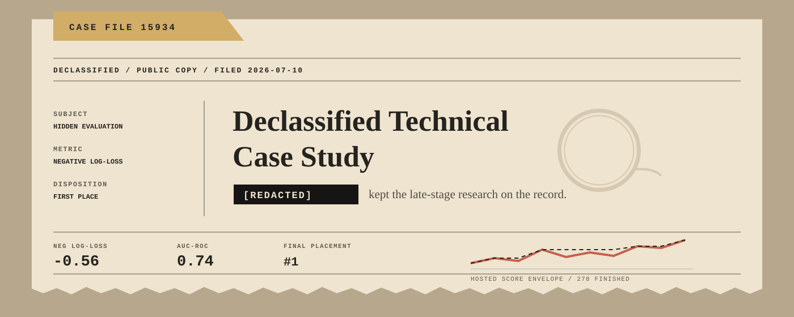

<picture>
  <source media="(prefers-color-scheme: dark)" srcset="assets/readme-hero-dark.svg">
  <source media="(prefers-color-scheme: light)" srcset="assets/readme-hero-light.svg">
  
</picture>

# Declassified Technical Case Study

First-place submission methodology for the AIMS Predictive Evaluation Competition, including calibration analysis, hosted evaluation evidence, and the role of `[REDACTED]`.

[Read the interactive case study](https://blakemasters.github.io/aims-competition/)

## Result

| Result | Value |
| --- | ---: |
| Placement | `#1` |
| Negative log-loss | `-0.56` |
| AUC-ROC | `0.74` |
| Competition activity | 122 participants, 5,363 submissions |

[`blakem31`](https://www.codabench.org/profiles/user/blakem31/) placed first with a negative log-loss of `-0.56` and AUC-ROC of `0.74`.

The case study covers the hidden-evaluation objective, construction of submission runtimes, 278 finished local evaluations, compact domain priors, revealed-label anchoring, and the research system presented as `[REDACTED]`.

## Repository files

- [`submission/`](submission/) contains representative submission source and a validated package.
- [`results/`](results/) contains hosted evaluation evidence.
- [`site/`](site/) contains the audited static case-study build served by GitHub Pages.

## Checks

```powershell
python tools/check_submission_zip.py submission/submission_anchor_fam_b60_debias.zip
python tools/run_smoke_test.py submission/source
```

## Publication boundary

The public files contain no hidden product name, private path, raw late-stage filename, or private build source. `[REDACTED]` is rendered literally throughout the publication.
